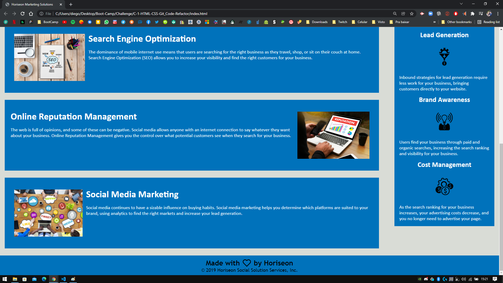

# Code Refactor Challenge 1

Targeted goals:

- Modify HTML and CSS to make it more accessible for people with disabilities.
- Condense CSS properties when if possible.
- Add Alt attributes for images.
- Proper utilization of Semantic HTML elements.
- Fix links in the navigation bar.
- Add Comments to HTML and CSS to help understand the structure and layout.

## Application deployed at URL:

https://kakudiego.github.io/C-1-HTML-CSS-Git_Code-Refactor/

## GitHub repository:

https://github.com/kakudiego/C-1-HTML-CSS-Git_Code-Refactor

### ScreenShots:

